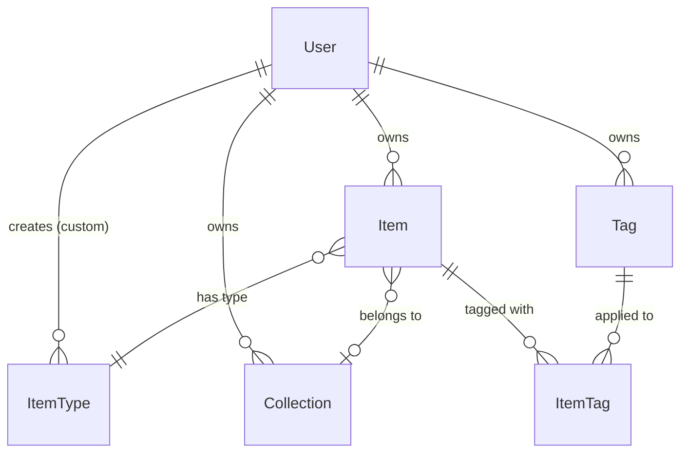
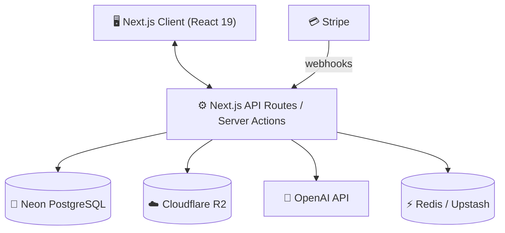
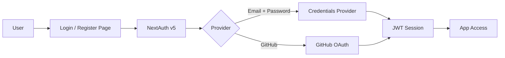
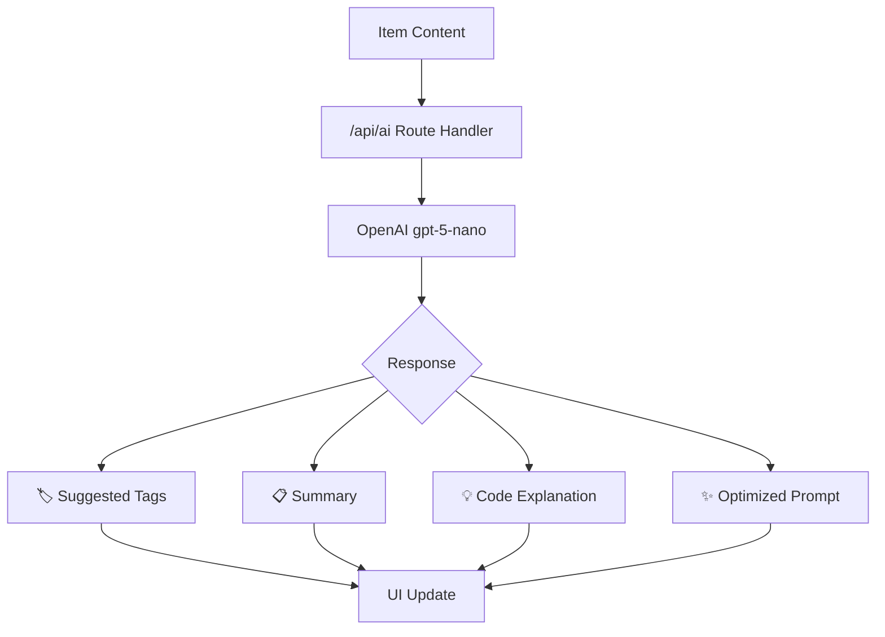

# DevStash — Project Overview

> 🚀 **Centralized Developer Knowledge Hub** for code snippets, AI prompts, docs, commands & more.
>
> *Store Smarter. Build Faster.*

---

## Table of Contents

1. [Problem Statement](#-problem-statement)
2. [Target Users](#-target-users)
3. [Core Features](#-core-features)
4. [Data Model (Prisma)](#-data-model-prisma)
5. [Tech Stack](#-tech-stack)
6. [Architecture](#-architecture)
7. [Auth Flow](#-auth-flow)
8. [AI Feature Flow](#-ai-feature-flow)
9. [Monetization](#-monetization)
10. [UI / UX Direction](#-ui--ux-direction)
11. [Development Workflow](#-development-workflow-for-course)
12. [Roadmap](#-roadmap)
13. [Status](#-status)

---

## 🎯 Problem Statement

Developers keep their essentials scattered across dozens of tools:

| What                  | Where it ends up             |
| --------------------- | ---------------------------- |
| Code snippets         | VS Code, Notion, Gists       |
| AI prompts            | Chat histories               |
| Context files         | Buried in project directories |
| Useful links          | Browser bookmarks             |
| Documentation         | Random folders                |
| Commands              | `.txt` files, bash history    |
| Project templates     | GitHub Gists, repos           |

**The result:** context switching, lost knowledge, and inconsistent workflows.

**DevStash** solves this by providing **one searchable, AI-enhanced hub** for all developer knowledge and resources.

---

## 🧑‍💻 Target Users

| Persona                    | Key Needs                                             |
| -------------------------- | ----------------------------------------------------- |
| **Everyday Developer**     | Quick access to snippets, commands, and links          |
| **AI-First Developer**     | Store & manage prompts, workflows, and context files   |
| **Content Creator / Educator** | Save course notes, reusable code examples          |
| **Full-Stack Builder**     | Patterns, boilerplates, API references                 |

---

## ✨ Core Features

### A) Items & System Item Types

Every piece of knowledge is an **Item**. Each item belongs to one **ItemType**:

| Type        | Icon | Description                        |
| ----------- | ---- | ---------------------------------- |
| `Snippet`   | `</>` | Code blocks with syntax highlighting |
| `Prompt`    | 🤖   | AI prompts & system instructions    |
| `Note`      | 📝   | Free-form markdown notes            |
| `Command`   | ⌨️    | CLI / terminal commands             |
| `File`      | 📄   | Uploaded files & templates          |
| `Image`     | 🖼️   | Screenshots, diagrams, assets       |
| `URL`       | 🔗   | Bookmarked links & references       |

> 💎 **Pro users** can create custom item types.

### B) Collections

Organize items into **Collections** — mixed item types allowed.

Examples: *React Patterns*, *Context Files*, *Python Snippets*, *Interview Prep*.

### C) Search

Full-text search across content, tags, titles, and types.

### D) Authentication

- Email + Password (credentials)
- GitHub OAuth

### E) Additional Features

- ⭐ Favorites & 📌 pinned items
- 🕑 Recently used / accessed
- 📥 Import from files (JSON, Markdown, etc.)
- ✏️ Markdown editor for text-based items
- 📎 File uploads (images, docs, templates)
- 📤 Export (JSON / ZIP)
- 🌙 Dark mode (default)

### F) AI Superpowers

| Feature               | Description                                      |
| --------------------- | ------------------------------------------------ |
| **Auto-tagging**       | Suggest relevant tags based on item content       |
| **AI Summaries**       | Generate concise summaries for long notes/docs    |
| **Explain Code**       | Break down code snippets in plain language         |
| **Prompt Optimization**| Improve and refine stored AI prompts              |

> Powered by [OpenAI `gpt-5-nano`](https://platform.openai.com/docs)

---

## 🗄️ Data Model (Prisma)

> Living schema — will evolve as features are built.

### Entity Relationship Diagram



### Schema

```prisma
// ─── USER ────────────────────────────────────────────
model User {
  id                   String         @id @default(cuid())
  email                String         @unique
  password             String?        // null when using OAuth
  isPro                Boolean        @default(false)
  stripeCustomerId     String?        @unique
  stripeSubscriptionId String?        @unique

  items                Item[]
  itemTypes            ItemType[]
  collections          Collection[]
  tags                 Tag[]

  createdAt            DateTime       @default(now())
  updatedAt            DateTime       @updatedAt
}

// ─── ITEM ────────────────────────────────────────────
model Item {
  id          String      @id @default(cuid())
  title       String
  contentType String      // "text" | "file"
  content     String?     @db.Text  // for text-based types (snippet, prompt, note, etc.)
  fileUrl     String?     // R2 URL for uploaded files
  fileName    String?
  fileSize    Int?
  url         String?     // for URL-type items
  description String?     @db.Text
  isFavorite  Boolean     @default(false)
  isPinned    Boolean     @default(false)
  language    String?     // programming language (for syntax highlighting)

  userId       String
  user         User        @relation(fields: [userId], references: [id], onDelete: Cascade)

  typeId       String
  type         ItemType    @relation(fields: [typeId], references: [id])

  collectionId String?
  collection   Collection? @relation(fields: [collectionId], references: [id], onDelete: SetNull)

  tags         ItemTag[]

  createdAt    DateTime    @default(now())
  updatedAt    DateTime    @updatedAt

  @@index([userId])
  @@index([typeId])
  @@index([collectionId])
}

// ─── ITEM TYPE ───────────────────────────────────────
model ItemType {
  id       String   @id @default(cuid())
  name     String   // e.g. "Snippet", "Prompt", "Note"
  icon     String?  // emoji or icon identifier
  color    String?  // hex color for UI badges
  isSystem Boolean  @default(false) // true = built-in, false = user-created (Pro)

  userId   String?
  user     User?    @relation(fields: [userId], references: [id], onDelete: Cascade)

  items    Item[]

  @@unique([name, userId]) // prevent duplicate type names per user
}

// ─── COLLECTION ──────────────────────────────────────
model Collection {
  id          String   @id @default(cuid())
  name        String
  description String?
  isFavorite  Boolean  @default(false)

  userId      String
  user        User     @relation(fields: [userId], references: [id], onDelete: Cascade)

  items       Item[]

  createdAt   DateTime @default(now())
  updatedAt   DateTime @updatedAt

  @@index([userId])
}

// ─── TAG ─────────────────────────────────────────────
model Tag {
  id     String    @id @default(cuid())
  name   String
  userId String
  user   User      @relation(fields: [userId], references: [id], onDelete: Cascade)

  items  ItemTag[]

  @@unique([name, userId]) // prevent duplicate tag names per user
  @@index([userId])
}

// ─── ITEM ↔ TAG (join table) ─────────────────────────
model ItemTag {
  itemId String
  tagId  String

  item   Item @relation(fields: [itemId], references: [id], onDelete: Cascade)
  tag    Tag  @relation(fields: [tagId], references: [id], onDelete: Cascade)

  @@id([itemId, tagId])
}
```

#### Refinements over original draft

- Added `onDelete` cascading rules to prevent orphaned records.
- Added `@@index` directives on foreign keys for query performance.
- Added `@@unique([name, userId])` on `Tag` and `ItemType` to prevent duplicates per user.
- Added `@unique` on Stripe fields to enforce one subscription per user.
- Applied `@db.Text` on long-text fields (`content`, `description`) for Postgres `TEXT` column type.

---

## 🧱 Tech Stack

| Category       | Choice                                                                 | Links                                                                                     |
| -------------- | ---------------------------------------------------------------------- | ----------------------------------------------------------------------------------------- |
| **Framework**  | Next.js 15 (App Router, React 19)                                      | [nextjs.org](https://nextjs.org)                                                          |
| **Language**   | TypeScript                                                              | [typescriptlang.org](https://www.typescriptlang.org)                                      |
| **Database**   | Neon (serverless Postgres) + Prisma ORM                                 | [neon.tech](https://neon.tech) · [prisma.io](https://www.prisma.io)                        |
| **Caching**    | Redis via Upstash *(optional, later)*                                   | [upstash.com](https://upstash.com)                                                        |
| **File Storage** | Cloudflare R2                                                        | [developers.cloudflare.com/r2](https://developers.cloudflare.com/r2)                       |
| **CSS / UI**   | Tailwind CSS v4 + shadcn/ui                                            | [tailwindcss.com](https://tailwindcss.com) · [ui.shadcn.com](https://ui.shadcn.com)        |
| **Auth**       | NextAuth v5 (Auth.js) — Email + GitHub providers                       | [authjs.dev](https://authjs.dev)                                                           |
| **AI**         | OpenAI `gpt-5-nano`                                                    | [platform.openai.com](https://platform.openai.com)                                         |
| **Payments**   | Stripe (subscriptions + webhooks)                                       | [stripe.com](https://stripe.com)                                                           |
| **Deployment** | Vercel                                                                  | [vercel.com](https://vercel.com)                                                           |
| **Monitoring** | Sentry *(later)*                                                        | [sentry.io](https://sentry.io)                                                             |

---

## 🔌 Architecture



---

## 🔐 Auth Flow



**Key details:**

- Sessions managed via JWT strategy (stateless, Vercel-friendly).
- GitHub OAuth for one-click sign-in.
- Email + password with bcrypt hashing via Credentials provider.
- Middleware protects authenticated routes.

---

## 🧠 AI Feature Flow



**Implementation notes:**

- AI calls are server-side only (API key stays on the server).
- Rate-limited per user to control costs.
- AI features gated behind the Pro plan.

---

## 💰 Monetization

| Plan     | Price              | Limits                          | Features                                                          |
| -------- | ------------------ | ------------------------------- | ----------------------------------------------------------------- |
| **Free** | $0                 | 50 items, 3 collections         | Basic search, image uploads, system item types, dark mode          |
| **Pro**  | $8/mo *or* $72/yr  | Unlimited items & collections   | File uploads, custom item types, AI features, export, priority support |

**Billing implementation:**

- Stripe Checkout for upgrades.
- Stripe Customer Portal for plan management.
- Webhooks (`checkout.session.completed`, `customer.subscription.updated`, `customer.subscription.deleted`) to sync subscription state to the `User` model.

---

## 🎨 UI / UX Direction

**Design principles:** Dark mode first · Minimal · Developer-friendly · Fast

**Inspiration:** Notion (flexibility), Linear (polish & speed), Raycast (keyboard-first UX)

### Layout

```
┌──────────────────────────────────────────────────┐
│  Header  (logo · search bar · user menu)         │
├────────────┬─────────────────────────────────────┤
│            │                                     │
│  Sidebar   │         Main Workspace              │
│            │                                     │
│  • All     │   ┌─────┐  ┌─────┐  ┌─────┐        │
│  • Favs    │   │Item │  │Item │  │Item │        │
│  • Recent  │   └─────┘  └─────┘  └─────┘        │
│  ─────     │   ┌─────┐  ┌─────┐  ┌─────┐        │
│  Types     │   │Item │  │Item │  │Item │        │
│  ─────     │   └─────┘  └─────┘  └─────┘        │
│  Colls     │                                     │
│            │                                     │
├────────────┴─────────────────────────────────────┤
│  (Full-screen item editor — opens on click)      │
└──────────────────────────────────────────────────┘
```

- **Sidebar:** collapsible, contains filters, item types, and collections.
- **Main area:** grid or list view (toggle), with sort/filter controls.
- **Editor:** full-screen overlay with markdown support & syntax highlighting.
- **Responsive:** mobile drawer for sidebar, touch-optimized targets.

---

## 🛠️ Development Workflow (For Course)

- **One branch per lesson** — students can follow along and diff against reference code.
- Use AI-assisted development (Cursor, Claude Code, ChatGPT).
- Sentry for runtime monitoring and error tracking.
- GitHub Actions for CI (optional).

**Branch convention:**

```bash
git switch -c lesson-01-setup
git switch -c lesson-02-prisma-schema
git switch -c lesson-03-auth
# ...
```

---

## 🧭 Roadmap

### Phase 1 — MVP

- [ ] Project setup (Next.js, Prisma, Neon, Tailwind, shadcn/ui)
- [ ] Authentication (email + GitHub via NextAuth v5)
- [ ] Items CRUD (create, read, update, delete)
- [ ] System item types (Snippet, Prompt, Note, Command, File, Image, URL)
- [ ] Collections CRUD
- [ ] Tags (manual)
- [ ] Full-text search
- [ ] Favorites & pinning
- [ ] Free-tier limits enforcement
- [ ] Dark mode

### Phase 2 — Pro

- [ ] Stripe integration (checkout, portal, webhooks)
- [ ] AI features (auto-tag, summarize, explain, optimize)
- [ ] Custom item types
- [ ] File uploads to Cloudflare R2
- [ ] Export (JSON / ZIP)
- [ ] Recently used tracking

### Phase 3 — Future Enhancements

- [ ] Shared / public collections
- [ ] Team & organization plans
- [ ] VS Code extension
- [ ] Browser extension (clip & save)
- [ ] Public API + CLI tool
- [ ] Redis caching layer
- [ ] Sentry monitoring

---

## 📌 Status

> **Phase:** Planning ✍️
>
> Ready for environment setup & UI scaffolding.

---

*DevStash — Store Smarter. Build Faster.* 🏗️
